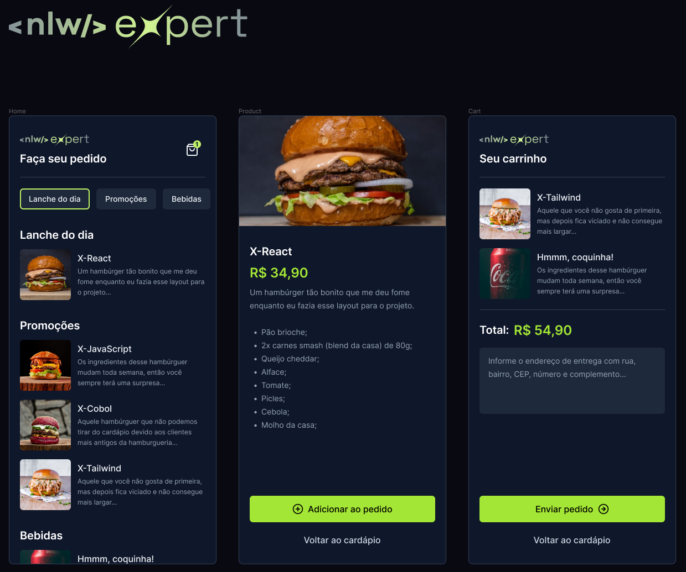

<h1 align="center">NLW-EXPERT-RN</h1>

<div align="center">
    
</div>

##

## 💬 Sobre o Projeto
Este projeto foi desenvolvido durante o evento NLW Expert da Rockeatseat, a ideia dele é simular um aplicativo de pedidos.

## 💻 Pré-Requisitos
- Node
- NPM
- Expo

## 📦 Alguns dos pacotes utilizados
- Clsx
- NativeWind(Tailwindcss)
- React-native-async-storage
- React-native-keyboard-aware-scroll-view
- Zustand

## 🚀 Instalando o projeto
Clone o repositório:
```bash
git clone https://github.com/gabrielcsilva1/nlw-expert-rn.git
```

Instalando as dependências
```bash
npm install
```

Rodando o app
```bash
npx expo start
```
